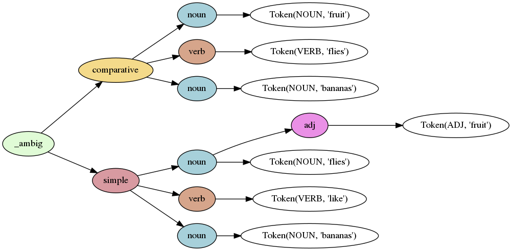

# Lark - a modern parsing library for Python

Parse any context-free grammar, FAST and EASY!

**Beginners**: Forget everything you knew about parsers. Lark's algorithm can quickly parse any grammar you throw at it, no matter how complicated. It also constructs a parse-tree for you, without additional code on your part.

**Experts**: Lark lets you choose between Earley and LALR(1), to trade-off power and speed. It also contains experimental features such as a contextual-lexer.

Lark can:

 - Parse all context-free grammars, and handle all ambiguity
 - Build a parse-tree automagically, no construction code required
 - Outperform all other Python libraries when using LALR(1) (Yes, including PLY)
 - Run on every Python interpreter (it's pure-python)

And many more features. Read ahead and find out.

Most importantly, Lark will save you time and prevent you from getting parsing headaches.

### Quick links

- [Documentation wiki](wiki)
- [Tutorial](/docs/json_tutorial.md) for writing a JSON parser.
- Blog post: [How to write a DSL with Lark](http://blog.erezsh.com/how-to-write-a-dsl-in-python-with-lark/)

### Hello World

Here is a little program to parse "Hello, World!" (Or any other similar phrase):

```python
from lark import Lark
l = Lark('''start: WORD "," WORD "!"
            %import common.WORD
            %ignore " "
         ''')
print( l.parse("Hello, World!") )
```

And the output is:

```python
Tree(start, [Token(WORD, 'Hello'), Token(WORD, 'World')])
```

Notice punctuation doesn't appear in the resulting tree. It's automatically filtered away by Lark.

### Fruit Flies Like Bananas

Lark is very good at handling ambiguity. Here's how it parses the phrase "fruit flies like bananas":



See more [examples in the wiki](wiki/Examples)


### Install Lark

    $ pip install lark-parser

Lark has no dependencies.

### Projects using Lark

 - [mappyfile](https://github.com/geographika/mappyfile) - a MapFile parser for working with MapServer configuration
 - [pytreeview](https://gitlab.com/parmenti/pytreeview) - a lightweight tree-based grammar explorer

Using Lark? Send me a message and I'll add your project!

### How to use Nearley grammars in Lark

Lark comes with a tool to convert grammars from [Nearley](https://github.com/Hardmath123/nearley), a popular Earley library for Javascript. It uses [Js2Py](https://github.com/PiotrDabkowski/Js2Py) to convert and run the Javascript postprocessing code segments.

Here's an example:
```bash
git clone https://github.com/Hardmath123/nearley
python -m lark.tools.nearley nearley/examples/calculator/arithmetic.ne main nearley > ncalc.py
```

You can use the output as a regular python module:

```python
>>> import ncalc
>>> ncalc.parse('sin(pi/4) ^ e')
0.38981434460254655
```

## List of Features

 - Builds a parse-tree (AST) automagically, based on the structure of the grammar
 - **Earley** parser
    - Can parse *ALL* context-free grammars
    - Full support for ambiguity in grammar
 - **LALR(1)** parser
    - Competitive with PLY
 - **EBNF** grammar
 - **Unicode** fully supported
 - **Python 2 & 3** compatible
 - Automatic line & column tracking
 - Standard library of terminals (strings, numbers, names, etc.)
 - Import grammars from Nearley.js
 - Extensive test suite

[](https://codecov.io/gh/erezsh/lark)
[](https://travis-ci.org/erezsh/lark)

See the full list of [features in the wiki](wiki/Features)

## Comparison to other parsers

### Lark does things a little differently

1. *Separates code from grammar*: Parsers written this way are cleaner and easier to read & work with.

2. *Automatically builds a parse tree (AST)*: Trees are always simpler to work with than state-machines. (But if you want to provide a callback for efficiency reasons, Lark lets you do that too)

3. *Follows Python's Idioms*: Beautiful is better than ugly. Readability counts.


### Lark is easier to use

- You can work with parse-trees instead of state-machines
- The grammar is simple to read and write
- There are no restrictions on grammar structure. Any grammar you write can be parsed.
    - Some structures are faster than others. If you care about speed, you can learn them gradually while the parser is already working
    - A well-written grammar is very fast
    - Note: Nondeterminstic grammars will run a little slower
    - Note: Ambiguous grammars (grammars that can be parsed in more than one way) are supported, but may cause significant slowdown if the ambiguity is too big)
- You don't have to worry about terminals (regexps) or rules colliding
- You can repeat expressions without losing efficiency (turns out that's a thing)

### Performance comparison

| Code | CPython Time | PyPy Time | CPython Mem | PyPy Mem
|:-----|:-------------|:------------|:----------|:---------
| **Lark - LALR(1)** | 4.7s | 1.2s | 70M | 134M |
| PyParsing | 32s | 3.5s | 443M | 225M |
| funcparserlib | 8.5s | 1.3s | 483M | 293M |
| Parsimonious | | 5.7s | | 1545M |

Check out the [JSON tutorial](/docs/json_tutorial.md#conclusion) for more details on how the comparison was made.


### Feature comparison

| Library | Algorithm | Grammar | Builds tree? | Supports ambiguity? | Can handle every CFG?
|:--------|:----------|:----|:--------|:------------
| **Lark** | Earley/LALR(1) | EBNF+ | Yes! | Yes! | Yes! |
| [PLY](http://www.dabeaz.com/ply/) | LALR(1) | Yacc-like BNF | No | No | No |
| [PyParsing](http://pyparsing.wikispaces.com/) | PEG | Parser combinators | No | No | No\* |
| [Parsley](https://pypi.python.org/pypi/Parsley) | PEG | EBNF-like | No | No | No\* |
| [funcparserlib](https://github.com/vlasovskikh/funcparserlib) | Recursive-Descent | Parser combinators | No | No | No |
| [Parsimonious](https://github.com/erikrose/parsimonious) | PEG | EBNF | Yes | No | No\* |


(\* *According to Wikipedia, it remains unanswered whether PEGs can really parse all deterministic CFGs*)

## License

Lark uses the [MIT license](LICENSE).

## Contribute

Lark is currently accepting pull-requests.

There are many ways you can help the project:

* Improve the performance of Lark's parsing algorithm
* Implement macros for grammars (important for grammar composition)
* Write new grammars for Lark's library
* Write & improve the documentation
* Write a blog post introducing Lark to your audience

If you're interested in taking one of these on, let me know and I will provide more details and assist you in the process.

## Contact

If you have any questions or want my assistance, you can email me at erezshin at gmail com.

I'm also available for contract work.
